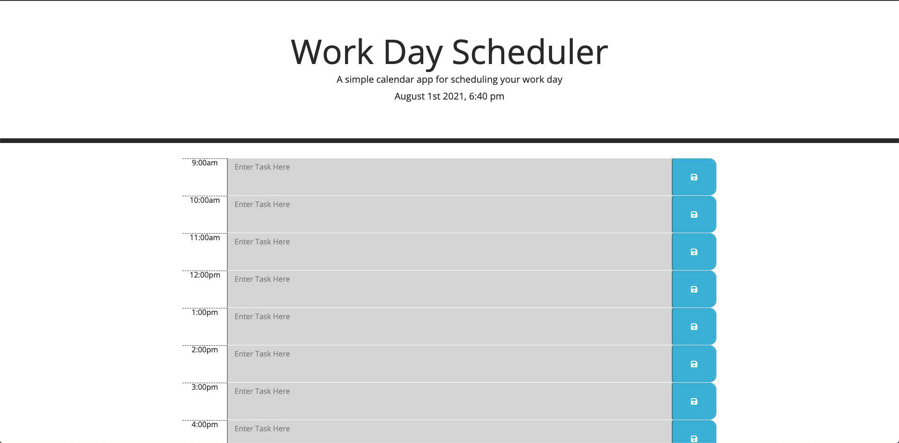

# 05-Third-Party-APIs

Use the provided framework to add in the script to match the gif mock up that was provided. The goal was to have a task track that when you added a task to a block of time you could save it. This saved information would stay with the user as it is stored in local storage. To bring a sense of organization and keep the user on track, the tool uses time to determine when the block of time is future, current, or past by changing the background color.

## GitHub Links

Live Page [Link](https://jeffcela.github.io/05-Third-Party-APIs/)  
Project Repository [Link](https://github.com/jeffcela/05-Third-Party-APIs)

## How its made!

Make sure to clone or download the entire repository as this document uses **HTML, CSS, GIFs and JavaScript files**. If you add in any additional features, please comment where you added them to make it easier for other developers to follow, you will see that comments have been left for future upgrades or tinkering

**What is included:**

- index.html
- gitignore (Used to prevent items from being added to the repo)
- assets folder
  - css folder
    - style.css
  - js folder
    - script.js
- README.md

_Please make sure that you are adding any additional assets as needed_

## This is what the Work Day Scheduler looks like!

# Credit 

_This homework assignment was completed in VS Code and Terminal by [Jeff Cela](https://www.linkedin.com/in/jeffcela/) on the day of 07/25/2021_ 
© 2021 Trilogy Education Services, LLC, a 2U, Inc. brand. Confidential and Proprietary. All Rights Reserved. 
_HTML._ W3Schools Online Web Tutorials. (1999). [https://www.w3schools.com/](https://www.w3schools.com/). 
Animated GIF Maker - Make GIFs from Images or Videos. (2012). https://gifmaker.me/.
